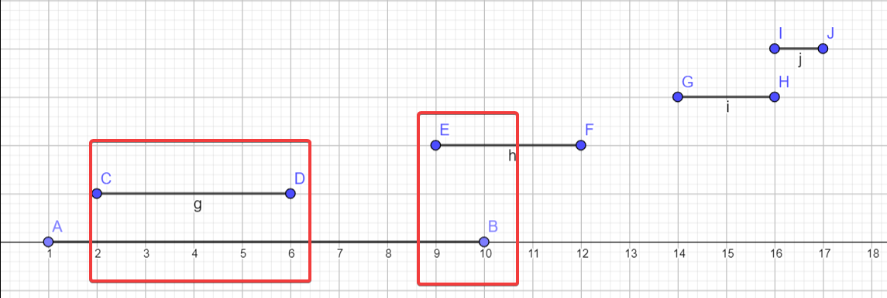

# Interview Questions

Created: Sep 5, 2020 4:05 PM
Updated: Nov 15, 2020 12:53 AM

- [Integer to Roman](https://leetcode.com/problems/integer-to-roman/)
- [Next Permutation](https://leetcode.com/problems/next-permutation/)
- [Roman to Integer](https://leetcode.com/problems/roman-to-integer/)
- [Valid Parentheses](https://leetcode.com/problems/valid-parentheses)
- [Search in Rotated Sorted Array](https://leetcode.com/problems/search-in-rotated-sorted-array)
- [Sudoku Solver](https://leetcode.com/problems/sudoku-solver)
- [Pow(x, n)](https://leetcode.com/problems/powx-n)
- [Maximum Subarray](https://leetcode.com/problems/maximum-subarray)
- [Merge Intervals](https://leetcode.com/problems/merge-intervals)
- [Insert Interval](https://leetcode.com/problems/insert-interval)
- [Valid Number](https://leetcode.com/problems/valid-number)
- [Plus One](https://leetcode.com/problems/plus-one)
- [Add Binary](https://leetcode.com/problems/add-binary)
- [Simplify Path](https://leetcode.com/problems/simplify-path)
- [Minimum Window Substring](https://leetcode.com/problems/minimum-window-substring)
- [Search in Rotated Sorted Array II](https://leetcode.com/problems/search-in-rotated-sorted-array-ii)
- [Merge Sorted Array](https://leetcode.com/problems/merge-sorted-array)
- [Binary Tree Level Order Traversal](https://leetcode.com/problems/binary-tree-level-order-traversal)
- [Best Time to Buy and Sell Stock](https://leetcode.com/problems/best-time-to-buy-and-sell-stock)
- [Best Time to Buy and Sell Stock III](https://leetcode.com/problems/best-time-to-buy-and-sell-stock-iii)
- [Binary Tree Maximum Path Sum](https://leetcode.com/problems/binary-tree-maximum-path-sum)
- [Valid Palindrome](https://leetcode.com/problems/valid-palindrome)
- [Clone Graph](https://leetcode.com/problems/clone-graph)
- [Read N Characters Given Read4](https://leetcode.com/problems/read-n-characters-given-read4)
- [Fraction to Recurring Decimal](https://leetcode.com/problems/fraction-to-recurring-decimal)
- [Best Time to Buy and Sell Stock IV](https://leetcode.com/problems/best-time-to-buy-and-sell-stock-iv)
- [Rotate Array](https://leetcode.com/problems/rotate-array)
- [Course Schedule](https://leetcode.com/problems/course-schedule)
- [Design Add and Search Words Data Structure](https://leetcode.com/problems/design-add-and-search-words-data-structure)
- [Kth Smallest Element in a BST](https://leetcode.com/problems/kth-smallest-element-in-a-bst)
- [Lowest Common Ancestor of a Binary Tree](https://leetcode.com/problems/lowest-common-ancestor-of-a-binary-tree)
- [Product of Array Except Self](https://leetcode.com/problems/product-of-array-except-self)
- [Group Shifted Strings](https://leetcode.com/problems/group-shifted-strings)
- [Binary Tree Paths](https://leetcode.com/problems/binary-tree-paths)
- [Palindrome Permutation](https://leetcode.com/problems/palindrome-permutation)
- [Alien Dictionary](https://leetcode.com/problems/alien-dictionary)
- [Closest Binary Search Tree Value](https://leetcode.com/problems/closest-binary-search-tree-value)
- [First Bad Version](https://leetcode.com/problems/first-bad-version)
- [Move Zeroes](https://leetcode.com/problems/move-zeroes)
- [Serialize and Deserialize Binary Tree](https://leetcode.com/problems/serialize-and-deserialize-binary-tree)
- [Remove Invalid Parentheses](https://leetcode.com/problems/remove-invalid-parentheses)
- [Longest Increasing Path in a Matrix](https://leetcode.com/problems/longest-increasing-path-in-a-matrix)
- [Insert Delete GetRandom O(1)](https://leetcode.com/problems/insert-delete-getrandom-o1)
- [Convert a Number to Hexadecimal](https://leetcode.com/problems/convert-a-number-to-hexadecimal)
- [Add Strings](https://leetcode.com/problems/add-strings)
- [Partition Equal Subset Sum](https://leetcode.com/problems/partition-equal-subset-sum)
- [Find All Anagrams in a String](https://leetcode.com/problems/find-all-anagrams-in-a-string)
- [Continuous Subarray Sum](https://leetcode.com/problems/continuous-subarray-sum) (Given a list of positive numbers and a target integer k, write a function to check if the array has a continuous subarray which sums to k.)
- [Subarray Sum Equals K](https://leetcode.com/problems/subarray-sum-equals-k)
- [Task Scheduler](https://leetcode.com/problems/task-scheduler)
- [Exclusive Time of Functions](https://leetcode.com/problems/exclusive-time-of-functions)
- [Valid Palindrome II](https://leetcode.com/problems/valid-palindrome-ii)
- [Is Graph Bipartite?](https://leetcode.com/problems/is-graph-bipartite)
- [Custom Sort String](https://leetcode.com/problems/custom-sort-string)
- [Smallest Subtree with all the Deepest Nodes](https://leetcode.com/problems/smallest-subtree-with-all-the-deepest-nodes)
- [Shortest Bridge](https://leetcode.com/problems/shortest-bridge)
- [Range Sum of BST](https://leetcode.com/problems/range-sum-of-bst)
- [Verifying an Alien Dictionary](https://leetcode.com/problems/verifying-an-alien-dictionary)
- [K Closest Points to Origin](https://leetcode.com/problems/k-closest-points-to-origin)
- [Interval List Intersections](https://leetcode.com/problems/interval-list-intersections)
- [Max Consecutive Ones III](https://leetcode.com/problems/max-consecutive-ones-iii)
- [Minimum Remove to Make Valid Parentheses](https://leetcode.com/problems/minimum-remove-to-make-valid-parentheses)
- A string / array problem involving distinct characters and window
- You are given a m * n grid. You are asked to generate k mines on this grid randomly. Each cell should have equal probability of k / m * n of being chosen. Your algorithm should run in O(m) time.
- [https://www.geeksforgeeks.org/find-index-maximum-occurring-element-equal-probability/](https://www.geeksforgeeks.org/find-index-maximum-occurring-element-equal-probability/)
- Similar strings ("face", "eacf") returns true if only 2 positions in the strings are swapped. Here 'f' and 'e' are swapped in the example.
- Number Of connected components in a Graph
- Given two binary search trees how do we merge everything so it prints inorder. The answer I gave was to run inorder on both trees and use "merge" from merge-sort.
- How to remove duplicates from a list
- You are given a m*n grid. You are asked to generate k mines on this grid randomly. Each cell should have equal probability of k / m*n of being chosen.
- You have an API to check if is it possible to move left, right, up, down and one more method to check if current position is the last one. Find the shortest way to the last position. You don't have any data structure - only API.
- Is there a way to reach (0,0) from a mXn matrix to (m-1,n-1) position and give the path.
- Calculate tax if Salary and Tax Brackets are given as list in the form[ [10000, 0.3],[20000, 0.2], [30000, 0.1], [null, .1]]null being rest of the salary
- n-ary Tree with each node having a boolean flag. Traverse all the nodes with only boolean flag = True. Return the total distance traveled from root to all those nodes.
- You're given a list of tasks, with number denoted different type of tasks, and there'll be interval between tasks with tasks of same id. Return total time for executing this task list.

    **Example:**

```
Input: tasks = [1, 1, 2, 1], interval = 2
Output: 7
Expalanation:
It's executed as 1 . . 1 2 . 1, so the total time is 7.

```

---

     Related problems: [https://leetcode.com/problems/task-scheduler/](https://leetcode.com/problems/task-scheduler/)

- You are given a shcedule of tasks to work on.

    Each tasks has a start and an end time `[start, end]` where `end > start`. 

    Find out for the given schedule:

    - in what intervals you are working (at least 1 task ongoing)
    - in what intervals you are multitasking (at least 2 tasks ongoing)

      In other words, find union and intersection of a list of intervals. The input is sorted by start time.

**Example:**

**Input:** [[1, 10], [2, 6], [9, 12], [14, 16], [16, 17]]

**Output union:** [[1, 12], [14, 17]]

**Explanation:** We just need to merge overlapping   intervals [https://leetcode.com/problems/merge-intervals](https://leetcode.com/problems/merge-intervals)

**Output intersection:** [[2, 6], [9, 10]]

**Explanation:**



**4. Design:**

1. Design Google search
2. Some question related to caching and balancing. Not exactly the "design twitter" type of question, but expect to talk about different components, latency, throughput, consistency and availability.
3. A remote server is not responding. Debug the issue. Needed to cover entire TCP/IP stack(fragmentation/icmp/etc) + machine metrics (vmstat,iostat,strace etc). Describe virtual memory in terms of demand paging.
4. 2 machines are connected, suddenly 1 machine is responding slowly. Why ?We had a good discussion in which we discussed everything under the sun, from NFS being bad to Networking being wrong to Kernel running out of resources(buffer-cache/inodes/virtual memory). Interviewer was interested to know the commands that i would use (strace, lsof, readlink, cat /proc/pid etc).
5. Copy some resource from N sources to M sinks. where N could be < 10 and M could be 10k/Millions etc.
6. Design File Storage System. Like Dropbox, Google Drive
7. Not any fancy one like design Twitter or Uber. More on scheduling service side and i designed using SQL appraoch. Discussed concuurency issues, Table schemas, composite keys etc.
8. Design recommendation of celebrities to user on Instagram
9. Design search for Twitter
10. Design a Content publishing site with privacy restrictions.
11. System Design of Uber. He liked my design. He was really nice guy, i felt he was interested in my success.
12. Design a type ahead features for a website. We discussed various data structures, advantage /disadvantages. Lot of different cases, scenario to handle etc.
13. Design instagram client side.
14. Design a leetcode contest, leadership board system
15. Design Instagram
16. Design keyword search in FB Posts
17. There are music providers like spotify, apple music etc. Design a service for these providers to display top 10 songs played by each user. Was aked to write ER tables and API's.
18. Design a system like Hacker Rank for a programming contest and their ranking.

**5. Behavioral:**

1. Work experience, past projects, standard "tell me about a time" questions, hypothetical scenario questions
2. Usual stuff around things that I am proud of/ projects that I regret etc
3. Tell me about your current role
4. Tell me about a projects you are proud of
5. Tell Me About A Time When You Had To Give Someone Difficult Feedback. How Did You Handle It?(What kind of feedback you give ?)
6. Tell me about a time when you had a conflict with a manage and how you resolved it
7. What's the most difficult/challenging problem you have had to solve?
8. Which environment is best to you to work ?
9. Tell about best decision in your life from childhood ? Decision that changed your life
10. On which topics you want improve? What are doing to impoving on that topics ? Did you try build project on that topics ?