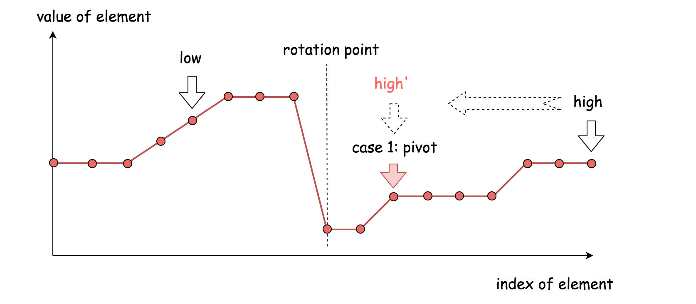
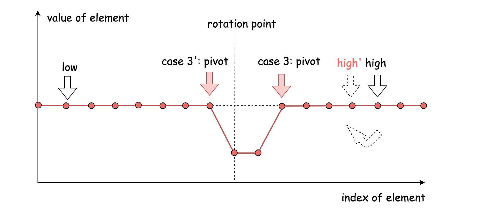

## Solution

#### Approach 1: Variant of Binary Search

**Intuition**

Given a sorted array in ascending order (denoted as `L[i]`), the array is then rotated over certain _unknown pivot_, (denoted as `L'[i]`). We are asked to find the _minimum value_ of this sorted and rotated array, which is to find the value of the first element in the original array, _i.e._ `L[0]`.

The problem resembles a common problem of _finding a given value from a sorted array_, to which problem one could apply the **binary search** algorithm. Intuitively, one might wonder if we could apply a variant of binary search algorithm to solve our problem here.

Indeed, this is the right intuition, though the tricky part is to figure out a _**concise solution**_ that could work for all cases.

To illustrate the algorithm, we draw the array in a 2D dimension in the following graph, where the X axis indicates the index of each element in the array and the Y axis indicates the value of the element.


_The main structure of our algorithm remains the same as the classical binary search algorithm._ As a reminder, we summarize it briefly as follows:

- We keep two pointers, _i.e._ `low`, `high` which point to the lowest and highest boundary of our search scope.

- We then reduce the search scope by moving either of pointers, according to various situations. Usually we shift one of pointers to the mid point between `low` and `high`, (_i.e._ `pivot = (low+high)/2`), which reduces the search scope down to half. This is also where the name of the algorithm comes from.

- The reduction of the search scope would stop, either we find the desired element or the two pointers converge (_i.e._ `low == high`).

**Algorithm**

In the classical binary search algorithm, we would compare the pivot element (_i.e._ `nums[pivot]`) with the value that we would like to locate. In our case, however, we would compare the pivot element to the element pointed by the upper bound pointer (_i.e._ `nums[high]`).

>Following the structure of the binary search algorithm, the essential part remained is to design the cases on how to update the two pointers.

Here we give one example on how we can break it down _**concisely**_ into three cases. Note that given the array, we consider the element pointed by the `low` index to be on the left-hand side of the array, and the element pointed by the `high` index to be on the right-hand side.  

>Case 1). `nums[pivot] < nums[high]`



- The pivot element resides in _the same half_ as the upper bound element.
- Therefore, the desired minimum element should reside to the **left-hand side** of pivot element. As a result, we then move the upper bound down to the pivot index, _i.e._ `high = pivot`.

>Case 2). `nums[pivot] > nums[high]`


- The pivot element resides in _the different half_ of array as the upper bound element.
- Therefore, the desired minium element should reside to the **right-hand side** of the pivot element. As a result, we then move the lower bound up next to the pivot index, _i.e._ `low = pivot + 1`. 

>Case 3). `nums[pivot] == nums[high]` 



- In this case, we are not sure which side of the pivot that the desired minimum element would reside.
- To further reduce the search scope, a safe measure would be to reduce the upper bound by one (_i.e._ `high = high - 1`), rather than moving _aggressively_ to the pivot point.
- The above strategy would prevent the algorithm from stagnating(停滞) (_i.e._ endless loop). More importantly, it maintains the **correctness** of the procedure, _i.e._ we would not end up with skipping the desired element.

To summarize, this algorithm differs to the classical binary search algorithm in two parts:

- We use the upper bound of search scope as the reference for the comparison with the pivot element, while in the classical binary search the reference would be the desired value.

- When the result of comparison is equal (_i.e._ Case #3), we further move the upper bound, while in the classical binary search normally we would return the value immediately.

Here are some sample implementations based on the above algorithm. _Note:_ the idea is inspired by the post from [sheehan](https://leetcode.com/problems/find-minimum-in-rotated-sorted-array-ii/discuss/48808/My-pretty-simple-code-to-solve-it) in the discussion forum.

```java
class Solution {
  public int findMin(int[] nums) {
    int low = 0, high = nums.length - 1;

    while (low < high) {
      int pivot = low + (high - low) / 2;
      if (nums[pivot] < nums[high])
        high = pivot;
      else if (nums[pivot] > nums[high])
        low = pivot + 1;
      else
        high -= 1;
    }
    return nums[low];
  }
}
```

**Complexity Analysis**

* Time complexity: on average O(log_2N) where N is the length of the array, since in general it is a binary search algorithm. However, in the worst case where the array contains identical elements (_i.e._ case #3 `nums[pivot]==nums[high]`), the algorithm would deteriorate to iterating each element, as a result, the time complexity becomes O(N).

* Space complexity: O(1), it's a constant space solution.


**Discussion**

>The problem is a follow-up to the problem of [153. Find Minimum in Rotated Sorted Array](https://leetcode.com/problems/find-minimum-in-rotated-sorted-array/). The difference is that in this problem the array can contain duplicates.
_So the question is "Would allow duplicates affect the run-time complexity? How and why?"_

First of all, the problem of [153. Find Minimum in Rotated Sorted Array](https://leetcode.com/problems/find-minimum-in-rotated-sorted-array/) can be considered as a specific case of this problem, where it just happens that the array does not contain any duplicate. As a result, the very solutions of this problem would work for the problem of [#153](https://leetcode.com/problems/find-minimum-in-rotated-sorted-array/) as well. It is just that we would never come cross the case #3 (_i.e._ `nums[pivot] == nums[high]`) in the problem of [#153](https://leetcode.com/problems/find-minimum-in-rotated-sorted-array/).

It is due to the fact that there might exist some duplicates in the array, that we come up the case #3 which eventually render the time complexity of the algorithm to be linear $$\mathcal{O}(N)$$, rather than $$\mathcal{O}(\log_{2}{N})$$.

>One might wonder that whether it works in case #3 if we move the lower boundary (_i.e._ `low += 1`), rather than the upper boundary (_i.e._ `high -= 1`).

The short answer is that it could work for some cases, but not for all. For instance, given the input `[1, 3, 3]`, by moving the lower boundary, we would skip the correct answer.

>While we do `low = pivot + 1` to reduce the search scope, then why not do `high = pivot - 1` instead of `high = pivot`?
Or a similar question would be _"why don't we do check of `low <= high` rather than `low < high`"?_

As a matter of fact, the binary search algorithm has several [forms of implementation](https://en.wikipedia.org/wiki/Binary_search_algorithm), regarding how we set the boundaries and the loop conditions. One can refer to the [Explore card of Binary Search](https://leetcode.com/explore/learn/card/binary-search/) in LeetCode for more details. As simple as the idea of binary search might seem to be, it is tricky to make it work for all cases.

As one would discover from the card, the above implementation of binary search complies with the [template II](https://leetcode.com/explore/learn/card/binary-search/126/template-ii/937/) of binary search. And by replacing `high = pivot` with `high = pivot - 1`, the algorithm will not work.

As subtle as it looks like, the update of the pointers should be consistent with the conditions of the loop. As a rule of thumb, it is advised to stick with one form of binary search, and not to mix them up.

> One might notice that we are calculating the pivot with the formula of `pivot = low + (high-low)/2`, rather than the more intuitive term `pivot = (high+low)/2`.

Actually, this is done intentionally to prevent the numeric overflow issue, since the sum of two integers could exceed the limit of the integer number. As a fun fact, the above mistake prevails in many implementations of binary search, as revealed from a post titled [_"Nearly All Binary Searches and Mergesorts are Broken"_](https://ai.googleblog.com/2006/06/extra-extra-read-all-about-it-nearly.html) from googleblog in 2006.