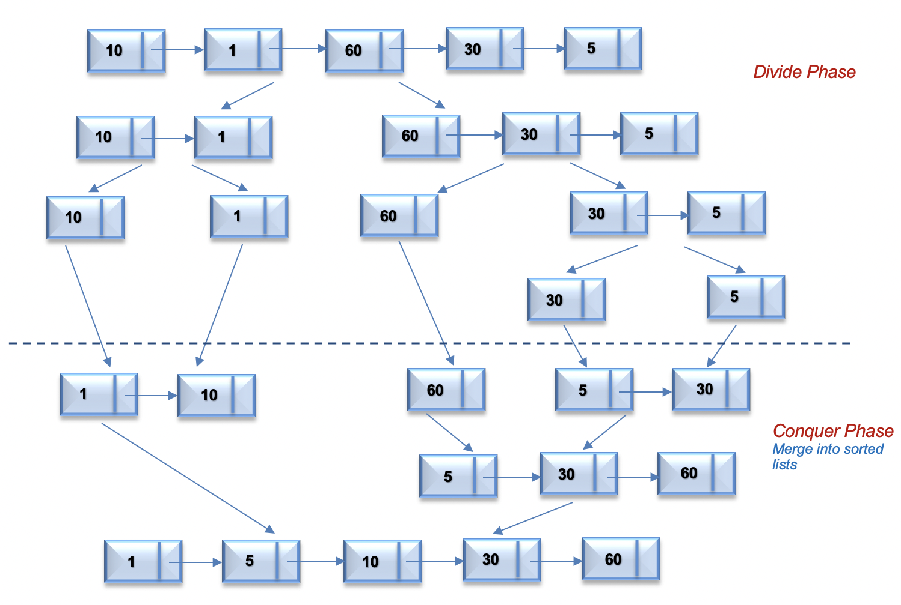
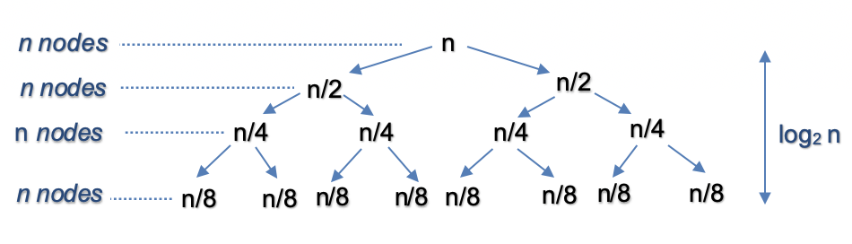
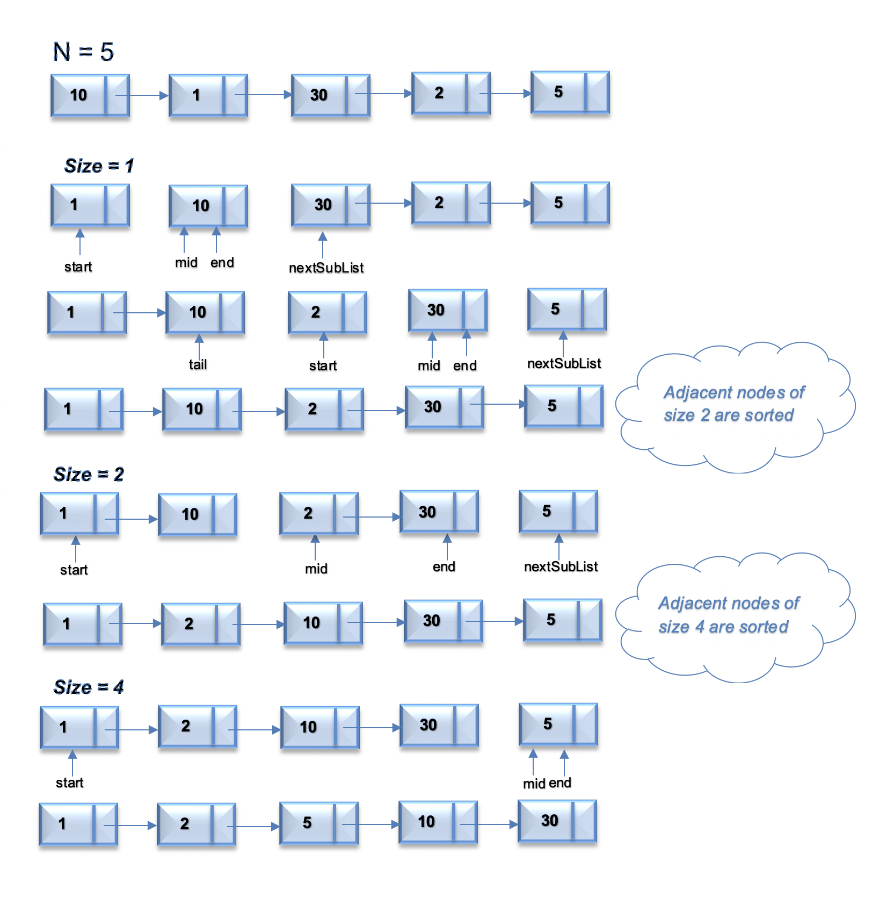

## Solution
---

#### Overview ####

The problem is to sort the linked list in $$\mathcal{O}(n \log n)$$ time and using only constant extra space. If we look at various sorting algorithms, [Merge Sort](https://en.wikipedia.org/wiki/Merge_sort) is one of the efficient sorting algorithms that is popularly used for sorting the linked list. The merge sort algorithm runs in $$\mathcal{O}(n \log n)$$ time in all the cases. Let's discuss approaches to sort linked list using merge sort.

> [Quicksort](https://en.wikipedia.org/wiki/Quicksort) is also one of the efficient algorithms with the average time complexity of $$\mathcal{O}(n \log n)$$. But the worst-case time complexity is $$\mathcal{O}(n ^{2})$$. Also, variations of the quick sort like randomized quicksort are not efficient for the linked list because unlike arrays, random access in the linked list is not possible in $$\mathcal{O}(1)$$ time.
If we sort the linked list using quicksort, we would end up using the head as a pivot element which may not be efficient in all scenarios.
---

#### Approach 1: Top Down Merge Sort

**Intuition**

Merge sort is a popularly known algorithm that follows the[ Divide and Conquer Strategy](https://en.wikipedia.org/wiki/Divide-and-conquer_algorithm). The divide and conquer strategy can be split into 2 phases:

 _Divide phase_: Divide the problem into subproblems.

_Conquer phase_: Repeatedly solve each subproblem independently and combine the result to form the original problem.

The Top Down approach for merge sort recursively splits the original list into sublists of equal sizes, sorts each sublist independently, and eventually merge the sorted lists.  Let's look at the algorithm to implement merge sort in Top Down Fashion.

**Algorithm**

- Recursively split the original list into two halves. The split continues until there is only one node in the linked list (Divide phase). To split the list into two halves, we find the middle of the linked list using the Fast and Slow pointer approach as mentioned in [Find Middle Of Linked List](https://leetcode.com/problems/middle-of-the-linked-list/).

```java
// If there are even nodes in the linked list, return the second middle node.
// 876. Middle of the Linked List
public ListNode middleNode(ListNode head) {
    ListNode slow = head;
    ListNode fast = head;

    while (fast != null && fast.next != null) {
        slow = slow.next;
        fast = fast.next.next;
    }

    return slow;
}
```

- Recursively sort each sublist and combine it into a single sorted list. (Merge Phase). This is similar to the problem [Merge two sorted linked lists](https://leetcode.com/problems/merge-two-sorted-lists/)

```java
public ListNode MergeTwoListsIIII(ListNode l1, ListNode l2) {
	// maintain an unchanging reference to node ahead of the return node.
	ListNode prehead = new ListNode(-1);

	ListNode prev = prehead;
	while (l1 != null && l2 != null) {
		if (l1.val <= l2.val) {
			prev.next = l1;
			l1 = l1.next;
		} else {
			prev.next = l2;
			l2 = l2.next;
		}
		prev = prev.next;
	}

	// At least one of l1 and l2 can still have nodes at this point, so connect
	// the non-null list to the end of the merged list.
	prev.next = l1 == null ? l2 : l1;

	return prehead.next;
}
```

The process continues until we get the original list in sorted order.

For the linked list = `[10,1,60,30,5]`, the following figure illustrates the merge sort process using a top down approach.



If we have sorted lists, list1 = `[1,10]` and list2 = `[5,30,60]`. The following animation illustrates the merge process of both lists into a single sorted list.

!?!./Documents/Sort_List_148_sort_list.json:1584,570!?!

```java
class Solution {
    public ListNode sortList(ListNode head) {
        if (head == null || head.next == null)
            return head;
        ListNode mid = getMid(head);
        ListNode left = sortList(head);
        ListNode right = sortList(mid);
        return merge(left, right);
    }

    ListNode merge(ListNode list1, ListNode list2) {
        ListNode dummyHead = new ListNode();
        ListNode tail = dummyHead;
        while (list1 != null && list2 != null) {
            if (list1.val < list2.val) {
                tail.next = list1;
                list1 = list1.next;
                tail = tail.next;
            } else {
                tail.next = list2;
                list2 = list2.next;
                tail = tail.next;
            }
        }
        tail.next = (list1 != null) ? list1 : list2;
        return dummyHead.next;
    }

    ListNode getMid(ListNode head) {
        ListNode midPrev = null;
        while (head != null && head.next != null) {
            midPrev = (midPrev == null) ? head : midPrev.next;
            head = head.next.next;
        }
        ListNode mid = midPrev.next;
        midPrev.next = null;
        return mid;
    }
}
```

**Complexity Analysis**

* Time Complexity: $$\mathcal{O}(n \log n)$$, where $$n$$ is the number of nodes in linked list.
The algorithm can be split into 2 phases, Split and Merge.

Let's assume that $$n$$ is power of $$2$$. For `n = 16`, the split and merge operation in  Top Down fashion can be visualized as follows



**_Split_**

The recursion tree expands in form of a complete binary tree, splitting the list into two halves recursively. The number of levels in a complete binary tree is given by $$\log_{2} n$$. For $$n=16$$, number of splits = $$\log_{2} 16 = 4$$

**_Merge_**

At each level, we merge n nodes which takes $$\mathcal{O}(n)$$ time.
For $$n = 16$$, we perform merge operation on $$16$$ nodes in each of the $$4$$ levels.

So the time complexity for split and merge operation is $$\mathcal{O}(n \log n)$$

* Space Complexity: $$\mathcal{O}(\log n)$$ , where $$n$$ is the number of nodes in linked list. Since the problem is recursive, we need additional space to store the recursive call stack. The maximum depth of the recursion tree is $$\log n$$

---

#### Approach 2: Bottom Up Merge Sort

**Intuition**

The Top Down Approach for merge sort uses $$\mathcal{O}(\log n)$$ extra space due to recursive call stack. Let's understand how we can implement merge sort using constant extra space using Bottom Up Approach.

The Bottom Up approach for merge sort starts by splitting the problem into the smallest subproblem and iteratively merge the result to solve the original problem.
- First, the list is split into sublists of size 1 and merged iteratively in sorted order. The merged list is solved similarly.

- The process continues until we sort the entire list.

This approach is solved iteratively and can be implemented using constant extra space. Let's look at the algorithm to implement merge sort in Bottom Up Fashion.


**Algorithm**

Assume, $$n$$ is the number of nodes in the linked list.
- Start with splitting the list into sublists of size $$1$$. Each adjacent pair of sublists of size $$1$$ is merged in sorted order. After the first iteration, we get the sorted lists of size $$2$$. A similar process is repeated for a sublist of size $$2$$. In this way, we iteratively split the list into sublists of size $$1,2,4,8 ..$$ and so on until we reach $$n$$.

- To split the list into two sublists of given $$\text{size}$$ beginning from $$\text{start}$$, we use two pointers, $$\text{mid}$$ and $$\text{end}$$ that references to the start and end of second linked list respectively. The split process finds the middle of linked lists for the given $$\text{size}$$.

- Merge the lists in sorted order as discussed in  _Approach 1_

- As we iteratively split the list and merge, we have to keep track of the previous merged list using pointer $$\text{tail}$$ and the next sublist to be sorted using pointer $$\text{nextSubList}$$.

For the linked list = `[10,1,30,2,5]`, the following figure illustrates the merge sort process using a Bottom Up approach.



```java
class Solution {
    ListNode tail = new ListNode();
    ListNode nextSubList = new ListNode();

    public ListNode sortList(ListNode head) {
        if (head == null || head.next == null)
            return head;
        int n = getCount(head);
        ListNode start = head;
        ListNode dummyHead = new ListNode();
        for (int size = 1; size < n; size = size * 2) {
            tail = dummyHead;
            while (start != null) {
                if (start.next == null) {
                    tail.next = start;
                    break;
                }
                ListNode mid = split(start, size);
                merge(start, mid);
                start = nextSubList;
            }
            start = dummyHead.next;
        }
        return dummyHead.next;
    }

    ListNode split(ListNode start, int size) {
        ListNode midPrev = start;
        ListNode end = start.next;
        //use fast and slow approach to find middle and end of second linked list
        for (int index = 1; index < size && (midPrev.next != null || end.next != null); index++) {
            if (end.next != null) {
                end = (end.next.next != null) ? end.next.next : end.next;
            }
            if (midPrev.next != null) {
                midPrev = midPrev.next;
            }
        }
        ListNode mid = midPrev.next;
        midPrev.next = null;
        nextSubList = end.next;
        end.next = null;
        // return the start of second linked list
        return mid;
    }

    void merge(ListNode list1, ListNode list2) {
        ListNode dummyHead = new ListNode();
        ListNode newTail = dummyHead;
        while (list1 != null && list2 != null) {
            if (list1.val < list2.val) {
                newTail.next = list1;
                list1 = list1.next;
                newTail = newTail.next;
            } else {
                newTail.next = list2;
                list2 = list2.next;
                newTail = newTail.next;
            }
        }
        newTail.next = (list1 != null) ? list1 : list2;
        // traverse till the end of merged list to get the newTail
        while (newTail.next != null) {
            newTail = newTail.next;
        }
        // link the old tail with the head of merged list
        tail.next = dummyHead.next;
        // update the old tail to the new tail of merged list
        tail = newTail;
    }

    int getCount(ListNode head) {
        int cnt = 0;
        ListNode ptr = head;
        while (ptr != null) {
            ptr = ptr.next;
            cnt++;
        }
        return cnt;
    }
}
```

**Complexity Analysis**

* Time Complexity: $$\mathcal{O}(n \log n)$$, where $$n$$ is the number of nodes in linked list.
 Let's analyze the time complexity of each step:

1) Count Nodes - Get the count of number nodes in the linked list requires $$\mathcal{O}(n)$$ time.

2) Split and Merge - This operation is similar to _Approach 1_ and takes  $$ \mathcal{O}(n \log n)$$ time.
For `n = 16`, the split and merge operation in Bottom Up fashion can be visualized as follows


This gives us total time complexity as
$$\mathcal{O}(n) + \mathcal{O}(n \log n) = \mathcal{O}(n \log n)$$

* Space Complexity: $$\mathcal{O}(1)$$ We use only constant space for storing the reference pointers  $$\text{tail}$$ , $$\text{nextSubList}$$ etc.