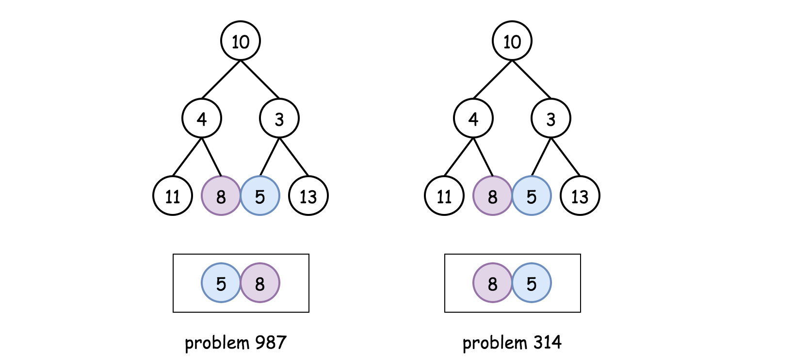

Given a binary tree, return the <em>vertical order</em> traversal of its nodes values.

For each node at position `(X, Y)`, its left and right children respectively will be at positions `(X-1, Y-1)` and `(X+1, Y-1)`.

Running a vertical line from `X = -infinity` to `X = +infinity`, whenever the vertical line touches some nodes, we report the values of the nodes in order from top to bottom (decreasing `Y` coordinates).

If two nodes have the same position, then the value of the node that is reported first is the value that is smaller.

Return an list of non-empty reports in order of `X` coordinate.  Every report will have a list of values of nodes.

**Example 1:**


```
Input: [3,9,20,null,null,15,7]

Output: [[9],[3,15],[20],[7]]

Explanation:

Without loss of generality, we can assume the root node is at position (0, 0):

Then, the node with value 9 occurs at position (-1, -1);

The nodes with values 3 and 15 occur at positions (0, 0) and (0, -2);

The node with value 20 occurs at position (1, -1);

The node with value 7 occurs at position (2, -2).
```

Example 2:


```
Input: [1,2,3,4,5,6,7]

Output: [[4],[2],[1,5,6],[3],[7]]

Explanation: 

The node with value 5 and the node with value 6 have the same position according to the given scheme.

However, in the report "[1,5,6]", the node value of 5 comes first since 5 is smaller than 6.
```

Note:

* The tree will have between `1` and `1000` nodes.
* Each node's value will be between `0` and `1000`.

## Solution

#### Overview

This is yet another problem about Binary Tree traversals. As one would probably know, the common strategies to traverse a _Tree_ data structure are **_Breadth-First Search_** (_a.k.a._ BFS) and **_Depth-First Search_** (_a.k.a._ DFS).

The DFS strategy can be further distinguished as _preorder DFS_, _inorder DFS_ and _postorder DFS_, depending on the relative order of visit among the node itself and its child nodes.

If one is not familiar with the concepts of BFS and DFS, we have an Explore card called [Queue & Stack](https://leetcode.com/explore/learn/card/queue-stack/) where we cover the [BFS traversal](https://leetcode.com/explore/learn/card/queue-stack/231/practical-application-queue/) as well as the [DFS traversal](https://leetcode.com/explore/learn/card/queue-stack/232/practical-application-stack/).
Hence, in this article, we won't repeat ourselves on these concepts.

In this problem, we are asked to return the **_vertical_** order of a binary tree, which implies three sub-orders (denoted as `<column, row, value>`) as follows:

- **column-wise order**
    
    First, we look at a binary tree _horizontally_. Each node would be aligned to a specific `column`, based on its relative _offset_ to the root node of the tree.
    
    Let us assume that the root node has a column index of `0`, then its left child node would have a column index of `-1`, and its right child node would have a column index of `+1`, and so on.
    
- **row-wise order**

    Secondly, we look at the binary tree _vertically_. Each node would be assigned to a specific `row`, based on its _level_ (_i.e._ the vertical distance to the root node).

    Let us assume that the root node has a row index of `0`, then both its child nodes would have the row index of `1`.
    Note that the convention we adopt here is slightly different from the one in the problem description where the row index of a parent node is larger than the one of its child nodes.
    This, though, would not jeopardize our solution. On the contrary, it would help us to simplify the solution, as one will see later.

- **value-wise order**


    Finally, given the definitions of the above two sub-orders, there could be a case where two different nodes have the same `<column, row>` index. As a result, to resolve the draw situation, as stated in the problem description, the node that has a smaller `value` should come first.

>Given the above definitions, we can now formulate the problem as a task to **sort** the nodes based on the 3-dimensional coordinates (_i.e._ `<column, row, value>`) that we defined above.

The priority of each coordinate is determined by its order.
For example, the coordinate `column` comes first, therefore it has the highest priority.
A node with the lowest `column` index would come up first, regardless the other two coordinates.

Before proceeding to the solutions, we would like to mention that there is another _almost_ identical problem called [314. Binary Tree Vertical Order Traversal](https://leetcode.com/problems/binary-tree-vertical-order-traversal/) in the LeetCode.

The only difference between these two problems lies in the _third_ sub-order.
When two nodes have the same `<column, row>` index, in this problem we would further order them based on their values, while in the problem of _314_ we would order them based on the horizontal order from left to right.
To illustrate the difference, we show an example in the following graph on how two nodes of the same `<column, row>` index should be ordered respectively in these two problems.



A subtle difference as it seems to be, yet it has a significant impact on the solutions.
As a spoiler alert, one could solve the problem of _314_ without resorting to the sorting operation, while for this problem the sorting is _inevitable_ due to the third sub-order required in the prob

---
#### Approach 1: BFS/DFS with Global Sorting

**Intuition**

In the overview section, we've reduced the problem into a sorting problem, based on the order of 3-dimensional coordinates `<column, row, value>` as we defined.

>As a result, the idea to solve the problem would be as intuitive as **_building_** a list where each element in the list corresponds to the 3-dimensional coordinates of each node in the tree, and then **_sorting_** the list based on the coordinates.

To build such a list, we would need to traverse all the nodes in the tree, which we could do with either Breadth-First Search (**BFS**) or Depth-First Search (**DFS**).
Most of the time, facing the problems of binary tree traversal, we need to make a choice between them.
However, in this case, both of the approaches would work.
Because both of them would lead to a list that contains the coordinates of all nodes. Though the order of elements in the list would differ depending on the approach, it does not matter, since we would _sort_ the list anyway. 

**Algorithm**

Based on the above intuition, we could implement the solution in 3 simple steps:

- **Step 1)**: we traverse the input tree either by BFS or DFS, in order to generate a list that contains the 3-dimensional coordinates (_i.e._ `<column, row, value>`) of each node.

    - Note that, we assign a higher `row` index value to a node's child node.
    This convention is at odds with the denotation given in the problem description.
    This is done _intentionally_, in order to keep the ordering of all coordinates consistent, _i.e._ a lower value in any specific coordinate represents a higher order.
    As a result, a sorting operation in ascending order would work for each coordinate consistently.
    
    
- **Step 2)**: Once we generate the desired list, we then _sort_ the list.

- **Step 3)**: From the _sorted_ list, we then extract the results, and group them by the `column` index.

In the following, we give some sample implementations with both the BFS traversal and the DFS traversal.

***BFS Traversal***

```java
class Triplet<F, S, T> {
    public final F first;
    public final S second;
    public final T third;

    public Triplet(F first, S second, T third) {
        this.first = first;
        this.second = second;
        this.third = third;
    }
}

class Solution {
    List<Triplet<Integer, Integer, Integer>> nodeList = new ArrayList<>();

    private void BFS(TreeNode root) {
        Queue<Triplet<TreeNode, Integer, Integer>> queue = new ArrayDeque();
        int row = 0, column = 0;
        queue.offer(new Triplet(root, row, column));

        while (!queue.isEmpty()) {
            Triplet<TreeNode, Integer, Integer> triplet = queue.poll();
            root = triplet.first;
            row = triplet.second;
            column = triplet.third;

            if (root != null) {
                this.nodeList.add(new Triplet(column, row, root.val));
                queue.offer(new Triplet(root.left, row + 1, column - 1));
                queue.offer(new Triplet(root.right, row + 1, column + 1));
            }
        }
    }

    public List<List<Integer>> verticalTraversal(TreeNode root) {

        List<List<Integer>> output = new ArrayList();
        if (root == null) {
            return output;
        }

        // step 1). BFS traversal
        BFS(root);

        // step 2). sort the global list by <column, row, value>
        Collections.sort(this.nodeList, new Comparator<Triplet<Integer, Integer, Integer>>() {
            @Override
            public int compare(Triplet<Integer, Integer, Integer> t1,
                    Triplet<Integer, Integer, Integer> t2) {
                if (t1.first.equals(t2.first))
                    if (t1.second.equals(t2.second))
                        return t1.third - t2.third;
                    else
                        return t1.second - t2.second;
                else
                    return t1.first - t2.first;
            }
        });

        // step 3). extract the values, partitioned by the column index.
        List<Integer> currColumn = new ArrayList();
        Integer currColumnIndex = this.nodeList.get(0).first;

        for (Triplet<Integer, Integer, Integer> triplet : this.nodeList) {
            Integer column = triplet.first, value = triplet.third;
            if (column == currColumnIndex) {
                currColumn.add(value);
            } else {
                output.add(currColumn);
                currColumnIndex = column;
                currColumn = new ArrayList();
                currColumn.add(value);
            }
        }
        output.add(currColumn);

        return output;
    }
}
```

Note: when extracting the desired result from the _sorted_ list, one would use the hashmap data structure, which could make the code more concise, as we did in the Python implementation.

Or, one could do so solely with the list data structure as we did in the Java implementation, which theoretically could be more efficient since we do not need to convert the results from hashmap to list.


***DFS Traversal***

```java
class Triplet<F, S, T> {
    public final F first;
    public final S second;
    public final T third;

    public Triplet(F first, S second, T third) {
        this.first = first;
        this.second = second;
        this.third = third;
    }
}

class Solution {
    List<Triplet<Integer, Integer, Integer>> nodeList = new ArrayList<>();

    private void DFS(TreeNode node, Integer row, Integer column) {
        if (node == null)
            return;
        nodeList.add(new Triplet(column, row, node.val));
        // preorder DFS traversal
        this.DFS(node.left, row + 1, column - 1);
        this.DFS(node.right, row + 1, column + 1);
    }

    public List<List<Integer>> verticalTraversal(TreeNode root) {
        List<List<Integer>> output = new ArrayList();
        if (root == null) {
            return output;
        }

        // step 1). DFS traversal
        DFS(root, 0, 0);

        // step 2). sort the list by <column, row, value>
        Collections.sort(this.nodeList, new Comparator<Triplet<Integer, Integer, Integer>>() {
            @Override
            public int compare(Triplet<Integer, Integer, Integer> t1,
                    Triplet<Integer, Integer, Integer> t2) {
                if (t1.first.equals(t2.first))
                    if (t1.second.equals(t2.second))
                        return t1.third - t2.third;
                    else
                        return t1.second - t2.second;
                else
                    return t1.first - t2.first;
            }
        });

        // step 3). extract the values, grouped by the column index.
        List<Integer> currColumn = new ArrayList();
        Integer currColumnIndex = this.nodeList.get(0).first;

        for (Triplet<Integer, Integer, Integer> triplet : this.nodeList) {
            Integer column = triplet.first, value = triplet.third;
            if (column == currColumnIndex) {
                currColumn.add(value);
            } else {
                output.add(currColumn);
                currColumnIndex = column;
                currColumn = new ArrayList();
                currColumn.add(value);
            }
        }
        output.add(currColumn);

        return output;
    }
}
```

**Complexity Analysis**

Let `N` be the number of nodes in the input tree.

- Time Complexity: `\mathcal{O}(N \log N)`, which applies to both the BFS and DFS approaches.

    - In the first step of the algorithm, we traverse the input tree with either BFS or DFS, which would take `O(N)` time.
    
    - Secondly, we sort the obtained list of coordinates which contains `N` elements. The sorting operation would take `\mathcal{O}(N \log N)` time.
    
    - Finally, we extract the results from the sorted list, which would take another `O(N)` time.
    
    - To summarize, the overall time complexity of the algorithm would be `\mathcal{O}(N \log N)`, which is dominated by the sorting operation in the second step.
    
- Space Complexity: `O(N)`. Again this applies to both the BFS and DFS approaches.

    - In the first step of the algorithm, we build a list that contains the coordinates of all the nodes. Hence, we need `O(N)` space for this list.
    
    - Additionally, for the BFS approach, we used a queue data structure to maintain the order of visits. At any given moment, the queue contains no more than **two levels** of nodes in the tree. The maximal number of nodes at one level is `\frac{N}{2}`, which is the number of the leaf nodes in a balanced binary tree. As a result, the space needed for the queue would be `\mathcal{O}(\frac{N}{2} \cdot 2) = O(N)`.
    
    - Although we don't need the queue data structure for the DFS approach, the recursion in the DFS approach incurs some additional memory consumption on the function call stack. In the worst case, the input tree might be completely imbalanced, _e.g._ each node has only the left child node. In this case, the recursion would occur up to `N` times, which in turn would consume `O(N)` space in the function call stack.
    
    - To summarize, the space complexity for the BFS approach would be `O(N) + O(N) = O(N)`. And the same applies to the DFS approach.

---
#### Approach 2: BFS/DFS with Partition Sorting

**Intuition**

As we can see in the above approaches, the overall time complexity is dominated by the sorting operation on the list of coordinates.
In order to further optimize the solution, we can try to do something with the sorting.

It would be hard, if not impossible, to eliminate the sorting operation, since we still need a means to resolve the draw situation when two nodes share the same `<column, row>` index.

One might argue that we could use the **heap** data structure (also known as `PriorityQueue` in Java) to maintain the list of coordinates.
The elements in the heap data structure are ordered automatically, and this does eliminate the sorting operation.
However, to maintain the elements in order, each insertion operation in heap would take `\mathcal{O}(\log N)` time complexity.
In other words, one can consider the heap data structure as another form of sorting, which amortizes the cost of sorting operating over each insertion.

One could apply the **heap** data structure to replace the sorting operation here, which could make the code more concise. But this is not the main point here.

>That being said, one thing that we can do is to reduce the scope of sorting, by **partitioning** the list of coordinates into subgroups based on the `column` index.


Although we would still need to sort the subgroups respectively, it would be **_faster_** to sort a series of subgroups than sorting them all together in a single group. Here is a not-so-rigid proof.

Suppose that we have a list of `N` elements, it would then take `\mathcal{O}(N \log N)` time to sort this list.

Next, we divide the list into `k` sublists equally. Each list would contain `\frac{N}{k}` elements.
Similarly, it would take `\mathcal{O}(\frac{N}{k} \log \frac{N}{k})` time to sort each sublist.

In total, to sort all the `k` sublists, it would take `\mathcal{O}(k \cdot \frac{N}{k} \log \frac{N}{k}) = \mathcal{O}(N \log \frac{N}{k})`, which is **less than** the time complexity of sorting the original list (_i.e._ `\mathcal{O}(N \log N)`).

>More importantly, another rationale to partition the list into `column` based groups is that this is also the format of results that are asked in the problem.

Once we sort the `column` based groups, we can directly return the groups as results, without the need for extraction as we did in the previous approach.

This is also the reason why we would _not_ recommend to further partition the list based on the combination of `<column, row>` index.
Although _theoretically_, the more groups that we partition the list into, the faster the sorting operations would be.

If we partition the list into the groups lead by `<column row>` index, we would need some additional processing to extract the results.
Hence, it would become an overkill.

**Algorithm**

We could implement the above intuition based on the previous approaches. Again, we could break it down into 3 steps:

- **Step 1)**: First of all, we create a hashmap called `columnTable` with the `column` index as key and the list of `<row, value>` tuples as value. This hashmap is used to hold the groups of coordinates.

    - We traverse the input tree by either BFS or DFS. During the traversal, we populate the hashmap that we created above.
    
    - Meanwhile, we also note down the minimal and maximal column index during the traversal. The minimal and maximal column index defines the range of column index. With this range, we could iterate through columns in order without the need for sorting, as one will see later.
    
    
- **Step 2)**: Once we populate the above hashmap, we then _sort_ the value in each entry of the hashmap, _i.e._ we sort each group of coordinates led by the `column` index.

- **Step 3)**: From the _sorted_ hashmap, we extract the results that are grouped by the `column` index.

In the following, we give some sample implementations with both the BFS traversal and the DFS traversal.


***BFS Traversal***

```java
class Solution {
    // key: column; value: <row, node_value>
    Map<Integer, ArrayList<Pair<Integer, Integer>>> columnTable = new HashMap();
    int minColumn = 0, maxColumn = 0;

    private void BFS(TreeNode root) {
        // tuples of <column, <row, value>>
        Queue<Pair<TreeNode, Pair<Integer, Integer>>> queue = new ArrayDeque();
        int row = 0, column = 0;
        queue.offer(new Pair(root, new Pair(row, column)));

        while (!queue.isEmpty()) {
            Pair<TreeNode, Pair<Integer, Integer>> p = queue.poll();
            root = p.getKey();
            row = p.getValue().getKey();
            column = p.getValue().getValue();

            if (root != null) {
                if (!columnTable.containsKey(column)) {
                    columnTable.put(column, new ArrayList<Pair<Integer, Integer>>());
                }
                columnTable.get(column).add(new Pair<>(row, root.val));
                minColumn = Math.min(minColumn, column);
                maxColumn = Math.max(maxColumn, column);

                queue.offer(new Pair(root.left, new Pair(row + 1, column - 1)));
                queue.offer(new Pair(root.right, new Pair(row + 1, column + 1)));
            }
        }
    }

    public List<List<Integer>> verticalTraversal(TreeNode root) {
        List<List<Integer>> output = new ArrayList();
        if (root == null) {
            return output;
        }

        // step 1). BFS traversal
        this.BFS(root);

        // step 2). retrieve the value from the columnTable
        for (int i = minColumn; i < maxColumn + 1; ++i) {
            // order by both "row" and "value"
            Collections.sort(columnTable.get(i), new Comparator<Pair<Integer, Integer>>() {
                @Override
                public int compare(Pair<Integer, Integer> p1, Pair<Integer, Integer> p2) {
                    if (p1.getKey().equals(p2.getKey()))
                        return p1.getValue() - p2.getValue();
                    else
                        return p1.getKey() - p2.getKey();
                }
            });

            List<Integer> sortedColumn = new ArrayList();
            for (Pair<Integer, Integer> p : columnTable.get(i)) {
                sortedColumn.add(p.getValue());
            }
            output.add(sortedColumn);
        }

        return output;
    }
}
```


***DFS traversal***

```java
class Solution {
    Map<Integer, ArrayList<Pair<Integer, Integer>>> columnTable = new HashMap();
    int minColumn = 0, maxColumn = 0;

    private void DFS(TreeNode node, Integer row, Integer column) {
        if (node == null)
            return;

        if (!columnTable.containsKey(column)) {
            this.columnTable.put(column, new ArrayList<Pair<Integer, Integer>>());
        }

        this.columnTable.get(column).add(new Pair<Integer, Integer>(row, node.val));
        this.minColumn = Math.min(minColumn, column);
        this.maxColumn = Math.max(maxColumn, column);
        // preorder DFS traversal
        this.DFS(node.left, row + 1, column - 1);
        this.DFS(node.right, row + 1, column + 1);
    }

    public List<List<Integer>> verticalTraversal(TreeNode root) {
        List<List<Integer>> output = new ArrayList();
        if (root == null) {
            return output;
        }

        // step 1). DFS traversal
        this.DFS(root, 0, 0);

        // step 2). retrieve the value from the columnTable
        for (int i = minColumn; i < maxColumn + 1; ++i) {
            // order by both "row" and "value"
            Collections.sort(columnTable.get(i), new Comparator<Pair<Integer, Integer>>() {
                @Override
                public int compare(Pair<Integer, Integer> p1, Pair<Integer, Integer> p2) {
                    if (p1.getKey().equals(p2.getKey()))
                        return p1.getValue() - p2.getValue();
                    else
                        return p1.getKey() - p2.getKey();
                }
            });

            List<Integer> sortedColumn = new ArrayList();
            for (Pair<Integer, Integer> p : columnTable.get(i)) {
                sortedColumn.add(p.getValue());
            }
            output.add(sortedColumn);
        }

        return output;
    }
}
```

**Complexity Analysis**

Let `N` be the number of nodes in the tree.

- Time Complexity: `\mathcal{O}(N \log{\frac{N}{k}})` where `k` is the width of the tree, _i.e._ `k` is also the number of columns in the result. 

    - In the first step, it takes `O(N)` time complexity for both the BFS and DFS traversal.
    
    - In the second step, we need to sort the hashmap entry by entry. As we shown in the intuition section, the time complexity of sorting `k` equal-sized subgroups of with total `N` elements would be `\mathcal{O}(k \cdot \frac{N}{k} \log{\frac{N}{k}}) =  \mathcal{O}(N \log{\frac{N}{k}}) `. If we assume that the nodes are evenly aligned in the columns, then this would be the time complexity of sorting the obtained hashmap.
    
    - Finally, it takes another `O(N)` time complexity to extract the results from the hashmap.
    
    - As a result, the overall time complexity is `\mathcal{O}(N \log{\frac{N}{k}})`.
    
    - Although the sorting operation in the second step still dominates, it is more optimized compared to the previous approach of sorting the entire coordinates.
    Let us look at one particular example. In the case where the tree is complete imbalanced (_e.g._ a node has only left node), the tree would be partitioned into exactly `N` groups. Each group contains a single element. It would take no time to sort each group. As a result, the overall time complexity of this approach becomes `N \cdot \mathcal{O}(1) = O(N)`.
    While for the previous approach, its overall time complexity remains `\mathcal{O}(N \log N)`. 
    
- Space Complexity: `O(N)`. Again this applies to both the BFS and DFS approaches. The analysis is the same as the previous approach.